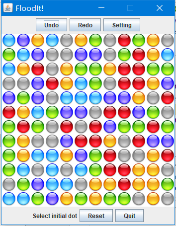
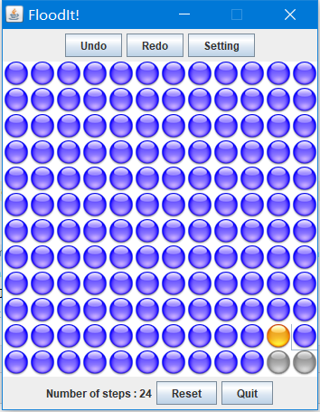

## FloodIt

A desktop game, which is a single player chess-style Java GUI application. 

## Tech Stack 

Eclipse, Java, OOP, MVC, Swing.
I used Object Orient programming (OOP) to design the Java interfaces and classes, and used Model-View-Controller (MVC) to split the Data, business logic and UI presentation tiers. I also implemented Java Swing GUI widget toolkit to build the desktop UI.

## Demo

  

  

